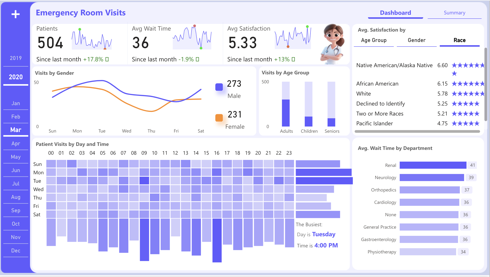
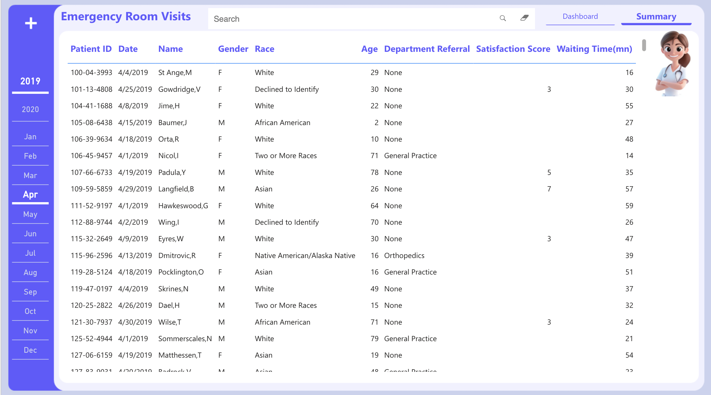

# 🏥 Healthcare Patient Flow Analytics Dashboard

An interactive Power BI dashboard built to optimize patient flow through hospital emergency departments. The goal of this project is to reduce wait times, identify bottlenecks, and enhance overall operational efficiency in healthcare systems through data-driven insights.

## 📊 Project Overview

This dashboard visualizes patient movement and department activity using historical hospital ER data. Key metrics like average wait times, patient satisfaction, gender/age distribution, and busiest time slots are highlighted to assist with real-time decision-making and predictive planning.

## 🔍 Objectives

- Reduce emergency room wait times
- Improve patient experience via satisfaction tracking
- Allocate staff and resources more efficiently
- Predict future patient volume trends (24/48/72 hours)
- Identify operational bottlenecks across departments

## 📸 Screenshots

### Dashboard Overview

### Patient Details (Summary)

## 🧩 Data Sources

The dashboard integrates multiple data formats:
- `Hospital ER.csv` – Patient admissions, discharges, satisfaction scores (CSV)
- `Department Transfers.json` – Logs of internal department movement (sample, not uploaded)
- `Bed Occupancy.sql` – SQL queries tracking real-time occupancy (structure implied)
- `Staff Schedule.xlsx` – Staff duty rosters (structure implied)
- `Wait_Times_History.csv` – Historic wait time trends

## 📐 Technical Architecture

### 🧱 Data Modeling
- **Star Schema**: Implemented with a central fact table (`Patient Visits`) and dimension tables like `Date`, `Department`, and `Demographics`.
- **DAX Calculations**: Used to define KPIs, bottleneck indicators, and peak time insights.
- **Row-Level Security (RLS)**: Configured to restrict department-specific views.
- **Custom Measures**:
  - `Avg Wait Time`
  - `Avg Satisfaction Score`
  - `Peak Hour per Department`
  - `Busiest Day & Time`

### 📆 Date Table
A comprehensive date dimension table was created using DAX for:
- Weekday grouping
- Monthly aggregation
- Time-based slicing (day/week/month)

## 📊 Dashboard Features

| Feature                          | Description |
|----------------------------------|-------------|
| KPI Cards                        | Shows real-time values for: `# of Patients`, `Avg Wait Time`, and `Satisfaction Score` |
| Gender & Age Analytics           | Line and bar graphs to show demographic breakdowns |
| Heatmap of Visits                | Hourly and daily breakdown to identify peak load times |
| Department-wise Wait Analysis    | Bar chart of avg wait times by department |
| Bottleneck Visualization         | Identifies and ranks departments with the longest delays |
| Predictive Volume Trend          | Forecasts for next 24/48/72 hours using historical trends (to be extended with ML) |
| Drill-Down & Filtering           | Filters for department, date, age group, and gender |

## 📁 Files Included

| File Name                            | Description |
|-------------------------------------|-------------|
| `Hospital ER.pbix`                  | Final Power BI dashboard file |
| `Hospital ER.csv`                   | Sample patient data |
| `Screenshot*.png`                   | Visual previews of dashboard views |

## 🚀 Future Improvements
- Integration with ML model for accurate patient volume forecasting
- Real-time API integration with hospital databases
- Advanced filters for patient condition/severity
- Enhanced drill-through functionality for individual case review

## 🛠️ Tools & Technologies
- **Power BI** (DAX, Power Query)
- **Excel** (for staff data input)
- **SQL Server** (bed occupancy)
- **JSON Parsing** (departmental logs)
- **Python (future)** – For predictive modeling & automation

## 🧠 Key Learnings
- Efficient healthcare operations rely on robust visual analytics
- Power BI's custom visuals & DAX empower deep operational insights
- Real-world hospital data poses data cleaning and modeling challenges

## 📬 Contact
**Author:** Arivunidhi Anna Arivan  
**LinkedIn:** [[LinkedIn Profile](https://www.linkedin.com/in/arivunidhi-anna-arivan/)] 
**Email:** [annaarivan.a@northeastern.edu](mailto:annaarivan.a@northeastern.edu)

---

